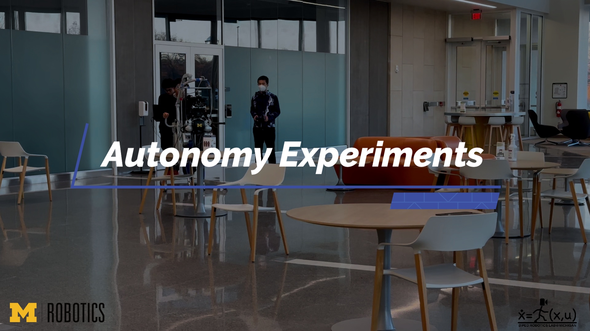
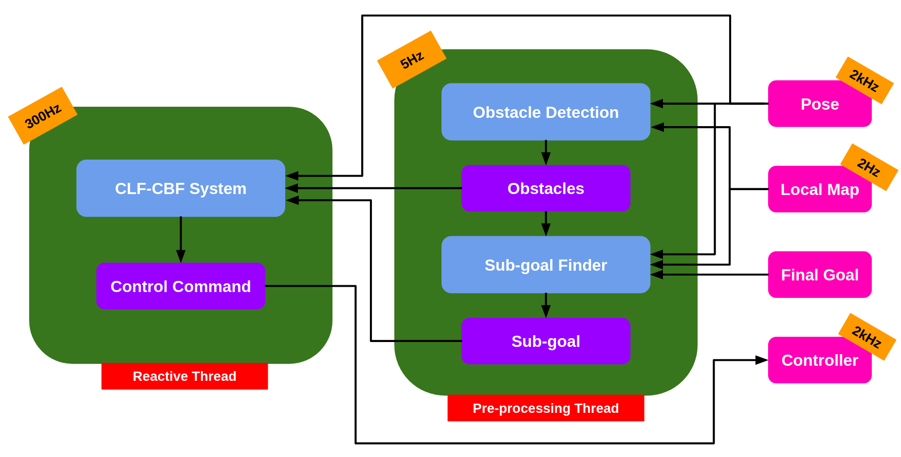
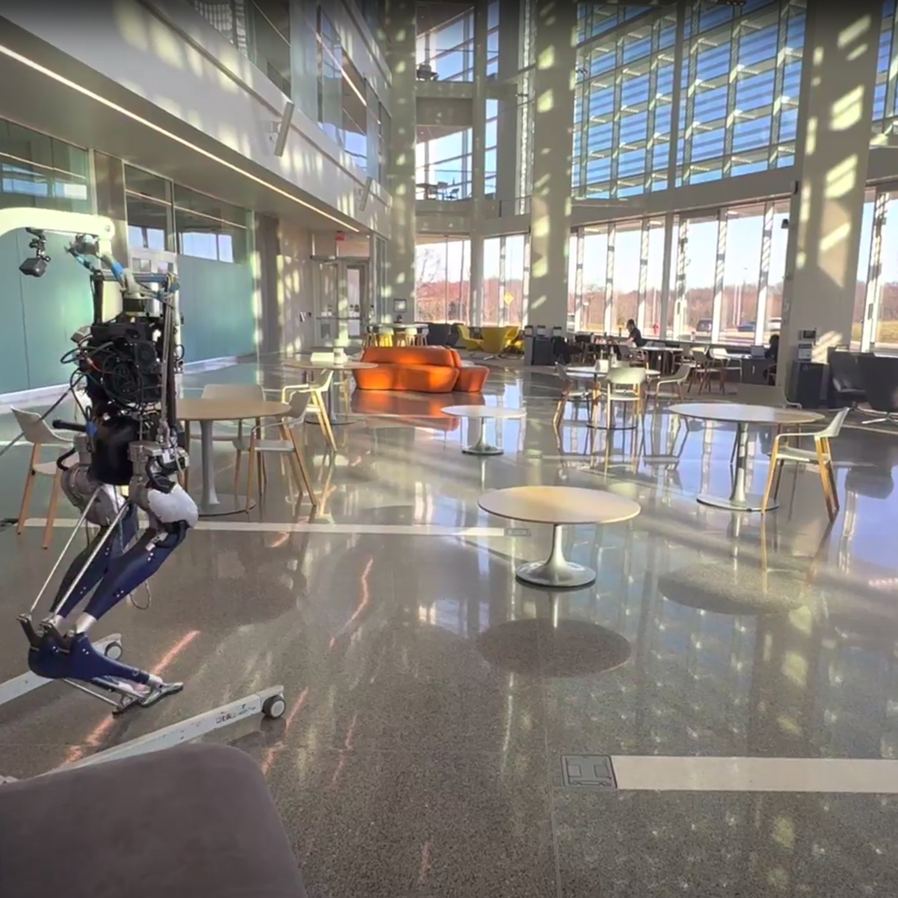
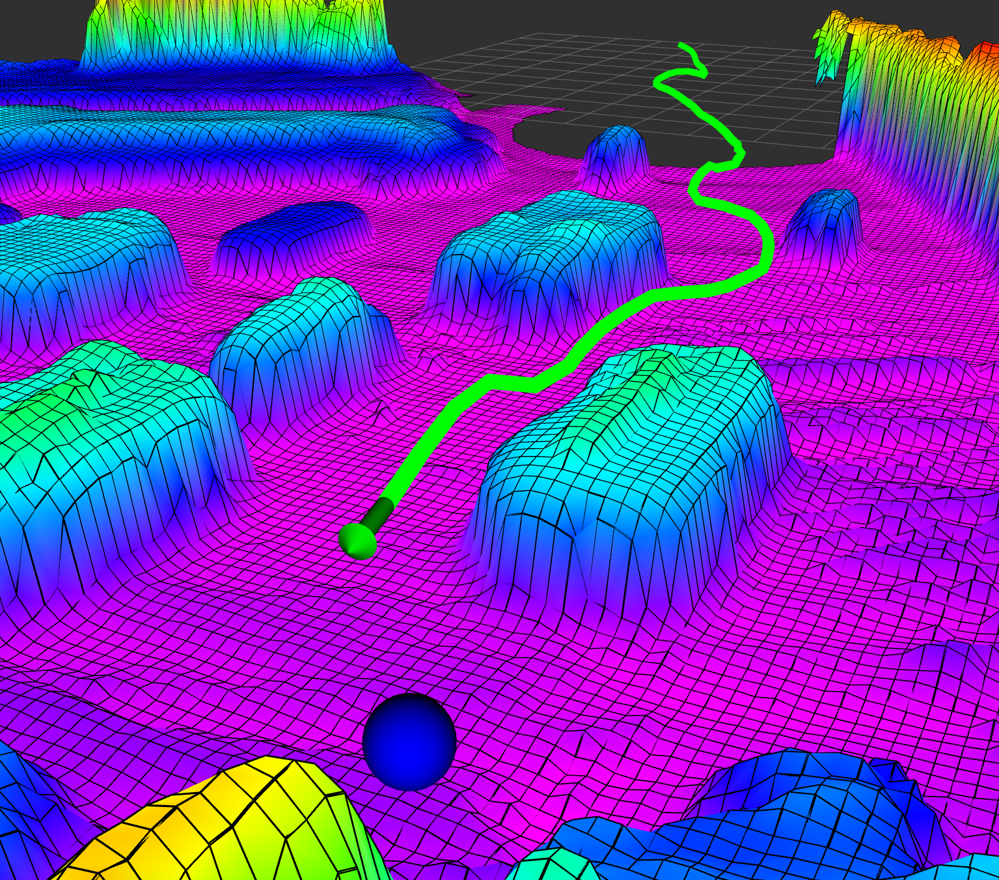
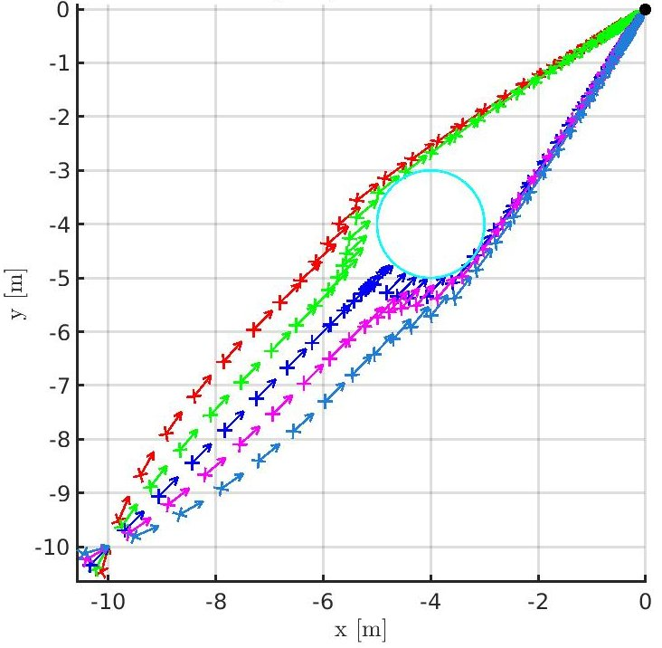
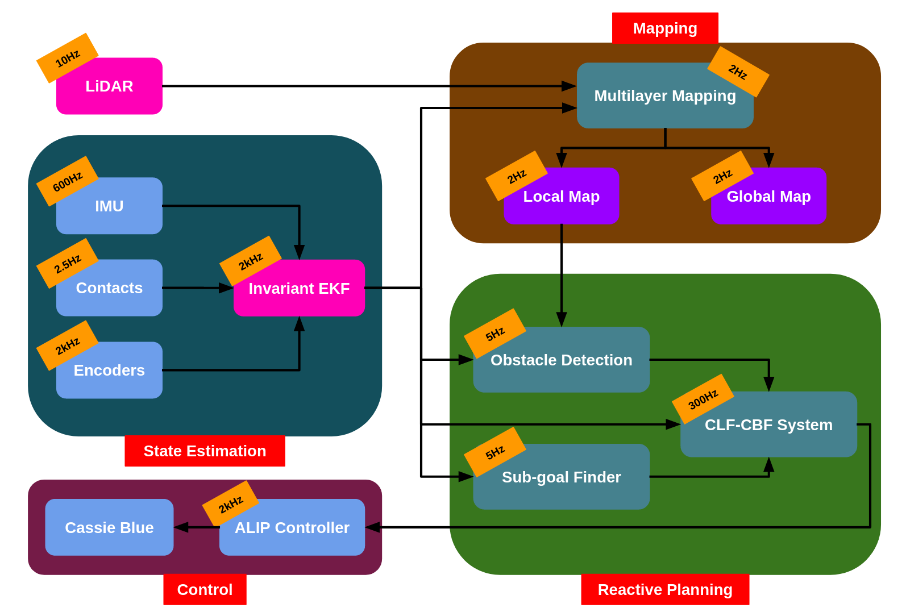

# Multi-Object Avoidance system via CLF-CBF

## Overview
This is a package for the obstacle avoidance system for bipedal robots via CLF-CBF constraints, described in paper: **Realtime Safety Control for Bipedal Robots to Avoid Multiple Obstacles via CLF-CBF Constraints** ([arXiv](https://arxiv.org/abs/2301.01906))

* **Author** : Jinze Liu*, Minzhe Li*, Jiunn-Kai Huang and Jessy W. Grizzle
* **Maintainer** : [Bruce JK Huang](https://www.brucerobot.com/), [Jinze Liu](https://www.jinzeliu.com/) and Minzhe Li
* **Affiliation**: [The Biped Lab](https://www.biped.solutions/), the University of Michigan

This package has been tested under **ROS Noetic** and **Ubuntu 20.04**.

Table of Contents
=================
* [Multi-Object Avoidance system via CLF-CBF](#multi-object-avoidance-via-clf-cbf)
   * [Overview](#overview)
* [Table of Contents](#table-of-contents)
   * [Abstract](#abstract)
   * [Video](#video)
   * [Realtime CLF-CBF System](#realtime-clf-cbf-system)
   * [Performance](#performance)
   * [Simulation Results](#simulation-results)
      * [Simulation Results with Single Obstacle in MATLAB](#simulation-results-with-single-obstacle-in-matlab)
      * [Multi-Obstacle Results with ROS in C++](#multi-obstacle-results-with-ros-in-c)
   * [Experimental Results](#experimental-results)
   * [Difference from CLF Reactive Planning System](#difference-from-clf-reactive-planning-system)
   * [Required System / Library / Packages](#required-system--library--packages)
   * [Regenerate Paper Results](#regenerate-paper-results)
      * [To Generate Simulation Results in MATLAB](#to-generate-simulation-results-in-matlab)
      * [To Generate Simulation Results with ROS in C++](#to-generate-simulation-results-with-ros-in-c)
   * [Citation](#citation)

## Abstract
This paper presents a reactive planning system that allows a Cassie-series bipedal robot to avoid multiple non-overlapping obstacles via a single, continuously differentiable control barrier function (CBF). The overall system detects an individual obstacle via a height map derived from a LiDAR point cloud and computes an elliptical outer approximation, which is then turned into a CBF. The QP-CLF-CBF formalism developed by Ames et al. is applied to ensure that safe trajectories are generated. Liveness is ensured by an analysis of induced equilibrium points that are distinct from the goal state. Safe planning in environments with multiple obstacles is demonstrated both in simulation and experimentally on the Cassie biped.

## Video
Please check the introduction [video](https://youtu.be/v35LioTwCa4). It highlights some keypoints in the paper.

[](https://youtu.be/v35LioTwCa4)

## Realtime CLF-CBF system
This work presents a means to leverage a smooth vector field to provide paths to the goal while avoiding multiple, non-overlapping obstacles. The developed realtime CLF-CBF system consists of a pre-processing thread (5Hz) and a reactive planning thread (300Hz). The pre-processing thread contains a robot-centric local map, obstacle detection to represent obstacles in CBF function, a sub-goal finder to give an intermediate target position. The reactive thread generates optimal control commands by solving the designed CLF-CBF quadratic programming.



## Performance
<p float="middle">
  
  
</p>

The developed CLF-CBF-QP obstacle avoidance system has been implemented in the real robot Cassie. Here is the elevation map built in real time experiment. The blue and cyan blobs are obstacles that Cassie detects and avoids.


## Simulation Results
The simulation results in MATLAB and ROS C++ are provided. The simulated robot is based on the ALIP model and accepts piece-wise constant inputs at the beginning of each step.

### Simulation Results with Single Obstacle in MATLAB
This section demonstrates the matlab simulation results with single obstacle in different scenarios.

<p float="middle">
  
</p>

The left picture shows how the trajectories vary as a function of a single obstacle’s position with a fixed initial robot pose.The red trajectory is the nominal trajectory without any obstacles present. Each colored trajectory and matching circle represent a distinct simulation result. The robot successfully avoids the obstacle in all cases. In the right picture, the trajectories vary as a function of different robot orientations with a fixed obstacle location.

### Multi-Obstacle Results with ROS in C++
This section demonstrates the ROS simulation results with multiple obstacle in challenging scenes. The highlighted area is the robot-centric local map.

#### Noise-free Map with 40 obstacles


## Experimental Results
The autonomy experiments are done with Cassie Blue. The system graph is shown in the figure. In the experiments, the invariant EKF state estimation node and mapping node are executed additionally. The reactive planner receives the robot pose and the local map, generates the optimal control commands and sends the control commands to Cassie Blue via UDP.



The experiments are conducted on the first floor of Ford Robotics Building at the University of Michigan. The highlighted area is the robot-centric local map.


## Difference from [CLF Reactive Planning System](https://github.com/UMich-BipedLab/CLF_reactive_planning_system)

In the CLF reactive planning system, the RRT algorithm is used to avoid the obstacles. The Multi-Object Avoidance system via CLF-CBF generates the optimal control commands avoiding the obstacles by solving a quadratic programming. Compared with the CLF reactive planning system, there is an obstacle detection algorithm to describe the obstacles in the quadratic programming. And in Multi-Object Avoidance system via CLF-CBF, the local map is received from the multilayer mapping node instead of getting the submap from the global elevation map.

## Required System / Library / Packages

1. Please install [ROS Noetic](http://wiki.ros.org/noetic/Installation/Ubuntu).
3. Please install [inekf_msgs](https://github.com/UMich-BipedLab/inekf_msgs). 
3. Please install [planner_msgs](https://github.com/UMich-BipedLab/planner_msgs). 
4. Please install [grid_map](https://github.com/UMich-BipedLab/customized_grid_map). 

The structure should be
catkin_ws  
└── src  
&nbsp;   &nbsp;   &nbsp;   &nbsp;   &nbsp;├── multi_object_avoidance_via_clf_cbf (This package)  
&nbsp;   &nbsp;   &nbsp;   &nbsp;   &nbsp;├── inekf_msgs  
&nbsp;   &nbsp;   &nbsp;   &nbsp;   &nbsp;├── planner_msgs  
&nbsp;   &nbsp;   &nbsp;   &nbsp;   &nbsp;└── customized_grid_map   

## Regenerate Paper Results

This section introduces how to regenerate the simulation results in the paper.

### To Generate Simulation Results in MATLAB

Simulation Process:
1. go to `/matlab_simulation/matlab_utils/plotting` folder.
2. add following code in `/plotRobotPose2D.m` after line 8.
```
pose(1:2,1) = pose(1:2,1) - R*arrowHead(:,2);
```

3. go to `/matlab_simulation` folder.

* To generate Fig. 3
  * set `test_case = 2` in `different_obstacle_scenarios_simulation.m`.
  * Run simulation process.


### To Generate Simulation Results with ROS in C++

Simulation Process:
1. `catkin_make` the package in the _catkin_ folder.
2. run `source devel/setup.bash`.
3. run `roslaunch cbf_cassie_planning fake_map.launch`.
5. run `roslaunch cbf_cassie_planning simulation.launch`.
6. run `rviz` and open _simulation.rviz_ under the _multi_object_avoidance_via_clf_cbf/rviz/_ folder. 
7. Click `Publish Point` and click on the map in Rviz. After robot reaches the target position, repeat this process and the next trajectory will be shown.

* To generate Fig. 4(a)
  * In `launch/fake_map.launch`, load `$(find cbf_cassie_planning)/config/obstacle1.yaml`.
  * In `launch/simulation.launch`, load `$(find cbf_cassie_planning)/config/simulation1.yaml`.
  * Run simulation process.

* To generate Fig. 4(b)
  * In `launch/fake_map.launch`, load `$(find cbf_cassie_planning)/config/obstacle1.yaml`.
  * In `launch/simulation.launch`, load `$(find cbf_cassie_planning)/config/simulation2.yaml`.
  * Run simulation process.


## Citation
The detailed is described in: **Realtime Safety Control for Bipedal Robots to Avoid Multiple Obstacles via CLF-CBF Constraints**, Jinze Liu*, Minzhe Li*, Jiunn-Kai (Bruce) Huang and Jessy W. Grizzle ([arXiv](https://arxiv.org/abs/2301.01906))
```
@misc{https://doi.org/10.48550/arxiv.2301.01906,
  title = {Realtime Safety Control for Bipedal Robots to Avoid Multiple Obstacles via CLF-CBF Constraints},
  author = {Liu, Jinze and Li, Minzhe and Huang, Jiunn-Kai and Grizzle, Jessy W.},
  doi = {10.48550/ARXIV.2301.01906},
  url = {https://arxiv.org/abs/2301.01906},
  publisher = {arXiv},
  year = {2023},
  copyright = {arXiv.org perpetual, non-exclusive license}
}
```

The CLF-CBF-QP matlab structure, we adapted and developed based on [CLF-CBF-Helper](https://github.com/HybridRobotics/CBF-CLF-Helper)
